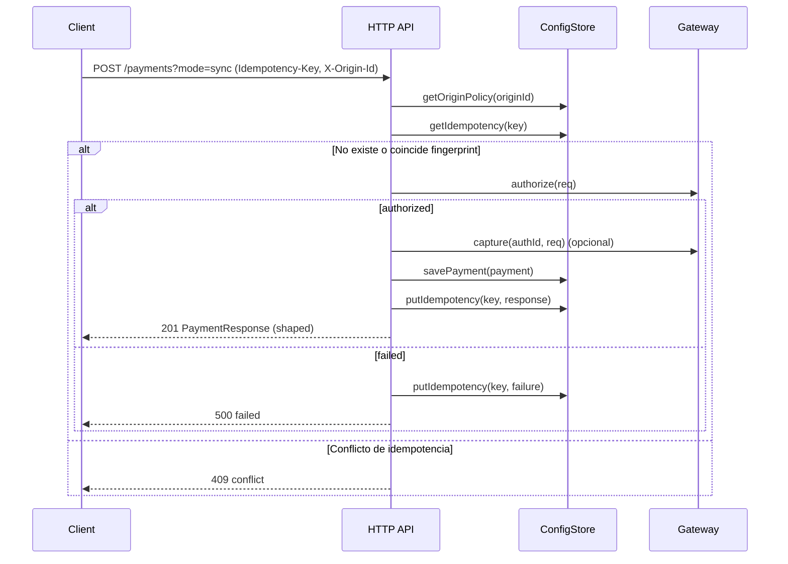
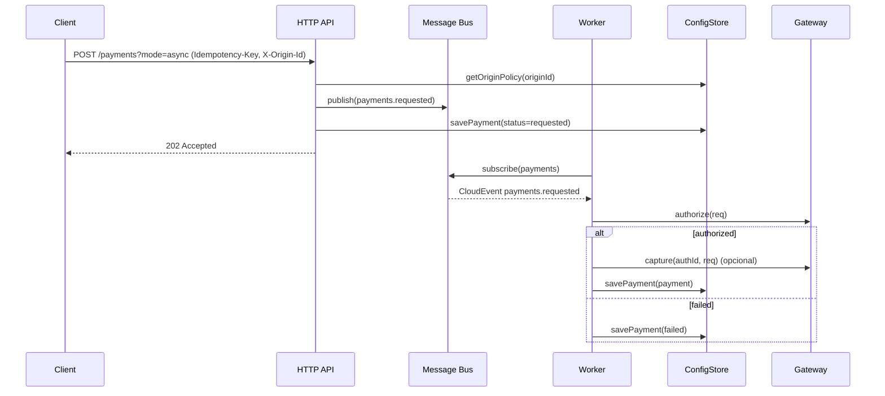

# Flujos de negocio

Este documento describe los casos de uso críticos y su interacción entre componentes mediante diagramas de secuencia.

## Procesar un pago (sync)

## Procesar un pago (async)

## Reembolso (borrador)
- Flujo simétrico a pagos; se emite `refunds.requested` y el worker procesa `refund` vía Gateway.

## Manejo de errores y reintentos
- API: responde 409 en conflicto de idempotencia y 422 en validación.
- Workers: reintentos según perfil del bus (ej. SQS visibility timeout, DLQ). Política de retry configurable por origin en futuras iteraciones.

## Consideraciones de ordenamiento
- FIFO (opcional): `messageGroupId` = `orderId`/`originId` y `dedupId` = `idempotencyKey`.
- Standard: eventual ordering; usar Outbox + versionado de eventos para idempotencia efectiva en consumidores.
